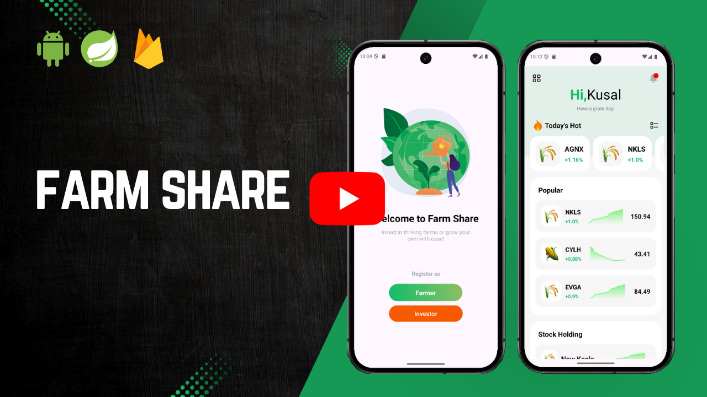

# FarmShare Investment & Produce Marketplace

## Description
FarmShare is designed to address a critical gap in Sri Lanka's agricultural investment system. Farmers often struggle to secure funding for their farms each season, relying on **bank loans or selling valuable assets** like gold. If the farm is destroyed due to weather or other factors, farmers **lose everything**, as they have no alternative income to repay their loans. This cycle of debt creates significant financial instability.

FarmShare solves this problem by introducing a **stock-based investment system**. Instead of relying on loans, farmers can **sell stock units** to investors, where **1 kg of farm output equals 1 stock unit**. This allows farmers to raise funds without financial risk, while investors gain a **structured, data-driven way** to invest in agriculture.

### Risk Score & Dynamic Stock Price Calculation
FarmShare calculates **risk scores** using **real-time weather data and soil conditions**:
- **Weather Risk Score** is derived from **temperature, wind speed, precipitation, and humidity** using a weather API.
- **Soil Risk Score** is based on **nutrient levels, organic matter, moisture content, and soil pH**, which the farmer provides.
- **Final Risk Score** = (Weather Risk Score + Soil Risk Score) / 2

Stock prices are **dynamically adjusted** based on the **risk score**, ensuring that investors make informed decisions. A **high-risk score** lowers stock prices to attract investors, while a **low-risk score** increases stock prices, reflecting a stable farm.

---

## Technologies Used
- **Android (Java)** – Mobile application frontend
- **Spring Boot (Java)** – Backend API
- **MySQL** – Primary database
- **Firebase Firestore** – Real-time database for transactions & notifications
- **Firebase Storage** – Cloud storage for farm documents & images
- **SQLite** – Local database storage
- **PayHere** – Payment gateway for stock purchases

---

## Project Overview
FarmShare consists of **three user roles**:
1. **Investor** – Browse farms, buy stocks, track investments, receive notifications.
2. **Farmer** – Register farms, release stock, upload soil data, manage farm progress.
3. **Admin** – Approve/reject farms, manage users, verify payments.

---

### Project Repositories
- **Frontend Repository (Android)**: [Link to Frontend Android Repo](https://github.com/kavindu-kodikara/Farm_Share.git)  
- **Backend Repository (Spring Boot)**: [Link to Backend Springboot Repo](https://github.com/kavindu-kodikara/Farm_Share_Backend.git)

---

### Click the image below to watch the full walkthrough video

---

## Features Breakdown

### **Welcome Page**
- Contains two buttons to navigate between **Investor** and **Farmer** sections.

---

## **Investor Features**

### **1. Sign Up & Sign In**
- Investors can register and log in with **smooth animations**.

### **2. Investor Home**
- Displays **most profitable farms** at the top.
- Shows **popular farms with high investor interest**.
- **Stock Holding** – Lists farms the user invested in, showing crop type, stock price trend, percentage change, and stock price.
- **Stock Allocation** – Displays investment breakdown in a **pie chart**.
- **Upcoming Payouts** – Shows expected investment returns.

### **3. Transactions Page**
- Lists **all investment transactions** and **investment returns**.

### **4. Farms Page**
- Displays **all active farms** with a **search function**.

### **5. Profile Page**
- Allows investors to **update profile picture and details**.

### **6. Single Farm Page**
- Displays **stock price trends (1 week, 1 month, current season)**.
- Shows **farm details, owner details, farm stage (Cultivating, Growing, Harvesting, etc.), risk score, location map, and images**.
- Includes **Buy Stock section**.

### **7. Stock Buy Page**
- Investors **select return type & stock amount**.
- **PayHere payment gateway opens** for secure transactions.
- After payment, an **invoice is generated and a notification is sent**.

---

## **Farmer Features**

### **1. Sign Up & Sign In**
- Same functionality as **Investor sign-in**.

### **2. Farmer Home**
- **Chips to navigate between added farms**.
- **Risk Score displayed in a donut chart** with a button for risk review.
- **Farm details & stage update button**.
- **Investment progress bar & stock price trend (last 7 days)**.
- **Investor list & stock release section**.
- **Upload soil details & soil report document**.

### **3. My Farms Page**
- Lists **all farms owned by the logged-in farmer**.

### **4. Add Farm Page**
- Farmers provide **farm name, crop type, size, avg yield, min investment stocks, ownership details, farm location on the map, images, and soil reports**.

### **5. Farmer Profile Page**
- Same functionality as **Investor Profile**.

---

## **Admin Features**

### **1. Farm Management**
- Admin can **approve or reject farm registration requests**.
- Activate or deactivate farms.

### **2. User Management**
- Admin can **block or activate users**.

### **3. Payments**
- After the farm season ends and farmers pay investors, admin can **approve or reject payment requests**.

---

## Disclaimer
**This project is part of my professional portfolio. You’re welcome to reference it, but please credit me if you reuse or adapt any part of it.**

## License
This project is licensed under the [MIT License](LICENSE).
